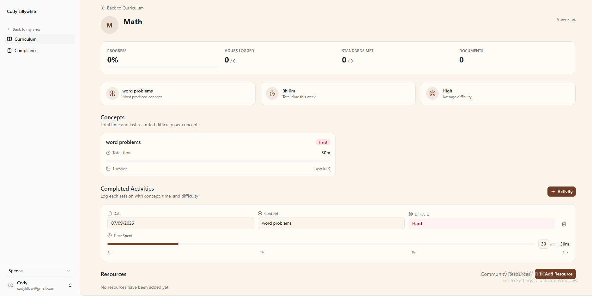

# Dragon's Nest API

A homeschool progress-tracking backend that helps managers monitor managed users' curriculum, activities, and concept mastery across subjects.

## Demo / Screenshot



## Key Features

- **Authentication** — Full Cognito-based auth flow with signup, login, MFA (authenticator app), WebAuthn/passkeys, and account recovery
- **Curriculum management** — Organize subjects, activities, and concepts per managed user
- **Progress dashboard** — Activity frequency and concept mastery tracking
- **State compliance** — Tools for checking homeschool compliance by state
- **Discovery & resources** — Browse and favorite educational resources
- **GeoIP** — MaxMind integration for location-aware features
- **Google integration** — Google OAuth and services support
- **Health checks** — Terminus-based readiness/liveness endpoints

## Tech Stack

- **Runtime:** Node.js + TypeScript
- **Framework:** NestJS
- **Database:** MongoDB (Mongoose ODM)
- **Auth:** AWS Cognito (SRP, MFA, WebAuthn) via `@aws-sdk/client-cognito-identity-provider`
- **Validation:** class-validator + class-transformer
- **API docs:** Swagger (`@nestjs/swagger`)
- **Testing:** Jest
- **Package manager:** pnpm

## Why I Built This

I built this to learn **Kiro**, **NestJS**, and **AWS Cognito**. I wanted a simple way to track progress in required subjects — including key concepts — to make sure my kid doesn't fall behind public schools while homeschooling.

The interesting technical challenge was wiring up Cognito's full auth surface (SRP-based login, TOTP MFA, WebAuthn passkeys, account recovery) through a NestJS backend while keeping the API clean and the frontend decoupled.

## Setup

### Prerequisites

- Node.js 20+
- pnpm
- Docker (for MongoDB)
- An AWS account with a Cognito User Pool configured

### Install & Run

```bash
# Install dependencies
pnpm install

# Start MongoDB
docker compose up -d

# Copy env template and fill in your values
cp .env.development.local .env.development.local  # edit with your Cognito pool details

# Run in dev mode
pnpm run start:dev
```

The API runs on `http://localhost:8080` by default. Swagger docs are available at `/api`.

## What I'd Improve Next

- Add missing unit and integration tests (coverage is sparse outside auth)
- Add rate limiting and request throttling
- Implement proper logging/observability (structured logs, correlation IDs)
- Add CI/CD pipeline
- Extract Cognito auth into a reusable library/module
- Add pagination to all list endpoints
